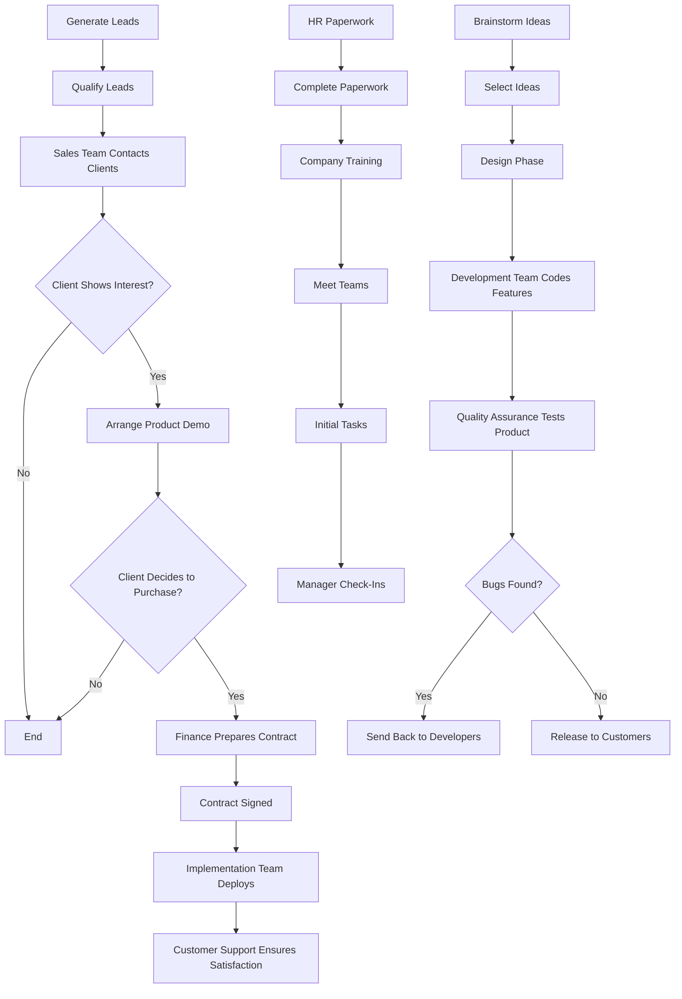

# Mermaid Formatting Demo

Open this file in a text editor, highlight the text to be formatted, and use the below Talon command to see the formatting in action.

## Command to Use

`model format mermaid`

## Description

This command converts plain text into the syntax for a mermaid diagram. It enables visual representation of workflows, processes, or relationships using mermaid's diagramming language.

## Text to Format

Company Workflow: The company starts by generating leads through marketing campaigns. Once leads are qualified, the sales team takes over and contacts the potential clients. If the client shows interest, a product demo is arranged. After the demo, the client decides whether or not to proceed with a purchase. If the client agrees, the finance department prepares the contract, and once signed, the implementation team begins working on deployment. Upon successful deployment, customer support ensures the client remains satisfied. Product Development Cycle: The product team begins by brainstorming ideas for new features. Once ideas are selected, they move to the design phase where wireframes and prototypes are created. The development team then takes over to code the features. After development is complete, the quality assurance team tests the product thoroughly. If any bugs are found, they are sent back to the developers for fixes. Once all issues are resolved, the product is released to customers. Employee Onboarding Process: New employees start by filling out HR paperwork. Once completed, they receive company training, which includes an introduction to company culture and their specific role responsibilities. After training, they meet their respective teams and begin working on their initial tasks. The manager will have regular check-ins during the first 90 days to ensure the employee's smooth transition into the company.

## Example Output

